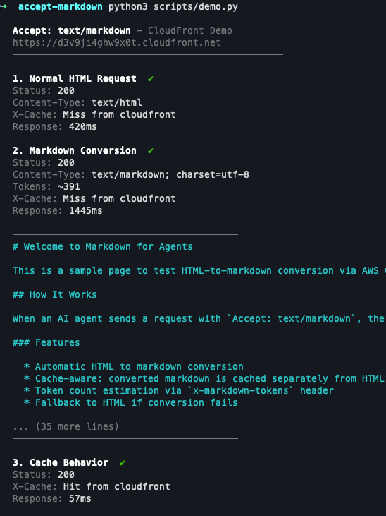

# accept-markdown

CloudFront-based content negotiation — returns markdown when agents send `Accept: text/markdown`.

> **Note:** This is a demo/educational project — not production-ready. See [Educational notice](#educational-notice).



## How it works

```
                          Accept: text/markdown
                 ┌─────────────────────────────────────┐
                 │           CloudFront                 │
                 │  ┌───────────────────────────────┐   │
   Agent ────────┼─▶│  CF Function (viewer-request)  │   │
                 │  │  detects Accept header,        │   │
                 │  │  injects x-content-format      │   │
                 │  └──────────┬────────────────────┘   │
                 │             │                        │
                 │     ┌───────┴───────┐                │
                 │     │  cache key:   │                │
                 │     │  path + fmt   │                │
                 │     └───┬───────┬───┘                │
                 │   miss  │       │ hit                │
                 │         ▼       ▼                    │
                 │  ┌─────────┐  cached                 │
                 │  │ Origin  │  response               │
                 │  │ Group   │                         │
                 └──┴────┬────┴─────────────────────────┘
                         │
            ┌────────────┴────────────┐
            │ markdown?               │ html?
            ▼                         ▼
   ┌─────────────────┐       ┌──────────────┐
   │  Lambda (OAC)   │       │   S3 Origin   │
   │                 │──────▶│   (HTML)      │
   │  fetch HTML,    │       └──────────────┘
   │  html2text,     │
   │  return .md +   │  
   │  token count    │
   └─────────────────┘
```

Normal requests (without the header) pass through to S3 and serve HTML as usual. If Lambda returns 5xx, CloudFront automatically falls back to S3 via origin group failover.

## Quick start

Prerequisites: AWS credentials configured, [OpenTofu](https://opentofu.org/) installed, [uv](https://docs.astral.sh/uv/) installed.

```bash
make deploy                # build Lambda package + deploy with OpenTofu
python3 scripts/demo.py    # run demo against the deployed CloudFront distribution
make destroy               # tear down all infrastructure
```

See the `Makefile` for all available commands.

## Educational notice

This is a demo/educational project illustrating how CloudFront Functions and Lambda can implement server-side content negotiation. It is **not** production-ready and is intended for learning purposes only.

## License

[CC BY-NC-ND 4.0](https://creativecommons.org/licenses/by-nc-nd/4.0/)
